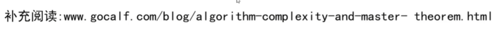
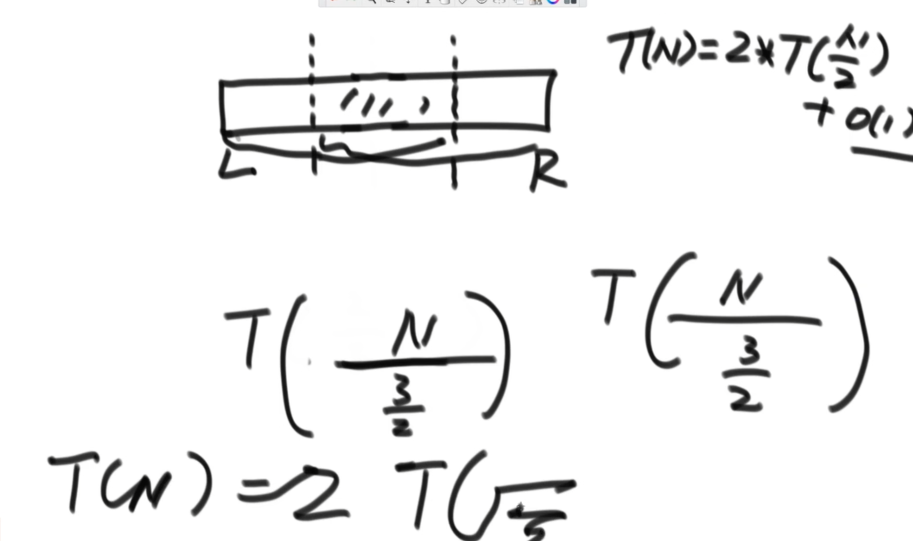
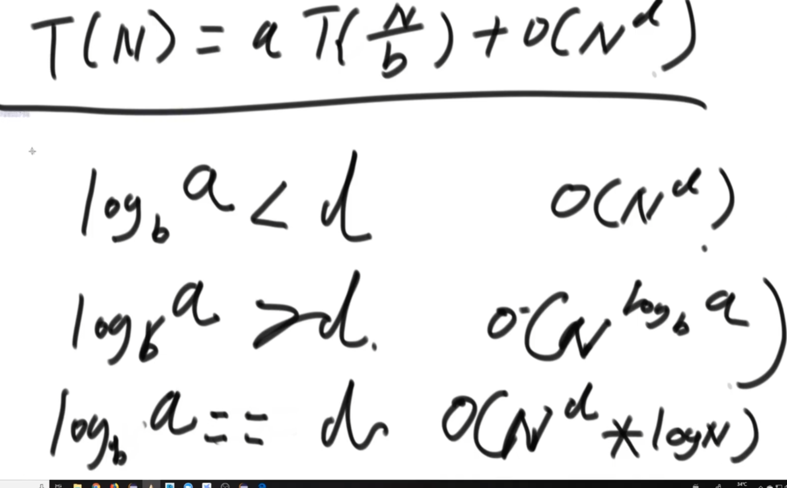

Master公式
T(N) = a * T(N/b) + O(N的d次方)
Tn指的是母问题的规模 ；
等号右边为函数中的细节；
a是母问题调用次数,T(N/b)指的是子问题的规模都是T(N/b)规模的问题， o(N的d次方)为除了子问题调用之外剩余部分的时间复杂度

以code03_getMax为例
leftMax调用的规模是N/2
rightMax调用的也是N/2
其余部分ifL==R直接返回，mid求了一个中点，return返回两个值比大小的结果，时间复杂度为O(1)
所以它的master公式为
T(N) = 2 * T(N/2) +O(1)
a=2;b=2;d=0
使用范围：只要满足子问题等规模的递归，都可以直接使用master求解时间复杂度

特殊例子，依旧以code03为例
若先以从左开始2/3部分取一个最大值，再以右边2/3部分取一个最大值，还能适用master公式吗？

答案是可以，虽然中间会有一个重合的区域，但最终覆盖了整个L~R,得到的最大值依旧是正确的
而且子问题的规模都为T(2N/3),要求是问题规模相同，而不是问题规模均等分
此时T(N) = 2 * T(2N/3) +O(1)

