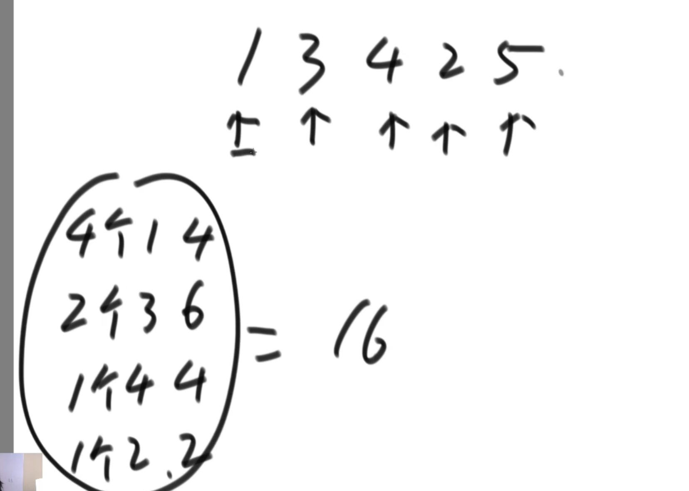

若有一个数组，内容为3，2,1,5,8,4
分别有L R以及中点M
先让L到M中的数字排好序为a组，为1 2 3
再让M到R中的数字排序为b组，为4 5 8
最后将他们Merge到一起，a组左侧一个下标i，b组左侧一个下标j
再另外取一个存储空间c，分别对比i与j下标所指的数字，谁小拷贝谁，指针后移；那一侧越界了，就把另一边剩余的内容拷贝下来

算法从选择排序的O(N^2)变为了N*log2n，变得更优秀了。因为它的比较没有被浪费，而是被merge到了一个有序的数组中。

小和是比它小的数的值的和，不是数量的和
1,3,4,2，5
1左边比它小的数没有，它的小和为0
3左边比它小的数为1，它的小和为1
4左边比它小的数为1,3，它的小和为1+3=4
2左边比它小的数为1，它的小和为1
5左边比它小的数为1,3,4,2，它的小和为1+3+4+2=10
小和为16

可以从找左边小的思路，变为找右边大的思路

这样就可以用归并排序进行，从n^2的时间复杂度，变得n*log2n

快排

3.0版本的快排，随机选一个位置，让他和最右位置交换，